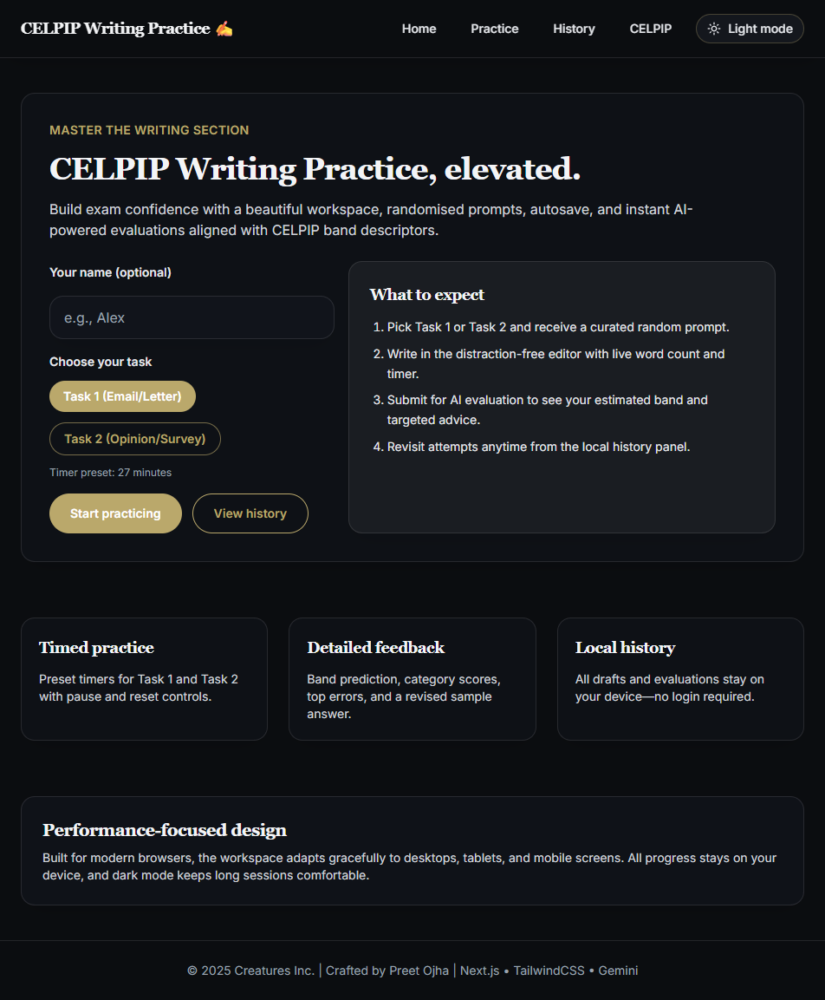

# CELPIP Writing Practice Studio

Modern writing lab for CELPIP Task 1 and Task 2 preparation. Switch between realistic prompts, draft with live guidance, and receive AI-powered scoring that mirrors examiner feedback.



---

## Why You'll Love It

- **Immersive workspace** – clean layout, dark/light themes, and a timer that mirrors official exam pacing.
- **Actionable feedback** – Gemini evaluates first, Groq backs it up, and the response is distilled into band scores, error patterns, and drills.
- **Local-first privacy** – drafts, timers, and score history stay in the browser; no logins or cloud sync required.
- **Session continuity** – autosave per user/task, resume where you left off, and view a timeline of past evaluations.
- **Prompt variety** – curated catalog plus instant randomization to keep practice fresh.

---

## Quick Start

```bash
# 1. Clone and enter
git clone <your-repo-url> celpip-writing-practice
cd celpip-writing-practice

# 2. Install dependencies
npm install

# 3. Add your API keys (see below)
cp .env.example .env.local   # or create manually

# 4. Launch the dev server
npm run dev
```

Visit http://localhost:3000 to begin practising immediately.

---

## Environment Variables

Create `.env.local` in the project root and set at least one provider key.

| Variable       | Required | Description                                         |
| -------------- | -------- | --------------------------------------------------- |
| GEMINI_API_KEY | Yes*     | Google Generative AI key for Gemini models.         |
| GROQ_API_KEY   | Optional | Groq key for high-speed fallback scoring.           |
| LLM_PRIMARY    | Optional | `gemini` (default) or `groq` to pick the first call. |
| GEMINI_MODEL   | Optional | Override Gemini model, e.g. `gemini-2.5-pro`.       |
| GROQ_MODEL     | Optional | Override Groq model, e.g. `llama3-70b-8192`.        |

*Provide at least one key (`GEMINI_API_KEY` or `GROQ_API_KEY`). If both are present, the app automatically falls back when the primary provider fails.

---

## Available Scripts

| Command         | Purpose                                                  |
| --------------- | -------------------------------------------------------- |
| `npm run dev`   | Starts Next.js in development mode with hot reload.      |
| `npm run build` | Compiles an optimized production build.                  |
| `npm start`     | Serves the production build (after `npm run build`).     |

---

## Interface Highlights

- **Task selector** (`components/TaskSelector.js`): curated Task 1/2 prompts with hover previews, randomise button, and task requirement snapshots.
- **Writing editor** (`components/WritingEditor.js`): word count, autosave, timer chip, prompt reminder card, and a four-action toolbar (submit, clear, new prompt, save draft).
- **Evaluation results** (`components/EvaluationResults.js`): animated accordion revealing band score, rubric breakdown, top errors, revision hints, and a suggested rewrite.
- **History view** (`pages/history.js`): chronological archive stored in `localStorage` with quick filters and a one-click reset.

---

## How the Evaluation Flow Works

1. Writer submits their answer with contextual metadata (name, task type, prompt).
2. `/api/evaluate` crafts an examiner-style schema prompt and sends it to the configured LLM.
3. Gemini responds in strict JSON; if it fails, Groq is retried automatically.
4. The response is normalised into the shape expected by the UI and saved locally for review.

All AI calls run server-side (Next.js API route) to keep keys private.

---

## Project Structure

```
celpip-writing-practice/
├─ components/           # UI building blocks (editor, timer, layout, etc.)
├─ lib/                  # Prompt catalog + localStorage helpers
├─ pages/                # Pages Router (index, practice, history, API route)
├─ styles/               # Tailwind and global styles
├─ public/               # Static assets (add screenshots/favicons here)
├─ package.json
└─ README.md
```

---

## Customising Your Practice Lab

- **Prompts**: Edit `lib/prompts.js` to tweak wording or add new scenarios. Each task entry carries its default timer length.
- **Timing**: Adjust the `minutes` value in each prompt entry to match your preferred pacing.
- **Theme**: Tailwind tokens live in `tailwind.config.js`; update the brand palette or spacing scale to match your styling.
- **Evaluation rubric**: Modify `CELPIP_SCHEMA_PROMPT` in `pages/api/evaluate.js` if you want to experiment with alternative rubrics or scoring language.

---

## Deploying to Production (Vercel-Friendly)

1. Push the project to your Git provider.
2. Import it into [Vercel](https://vercel.com/) and select the repository.
3. Add the same environment variables from `.env.local` to the project settings.
4. Trigger a deployment. The Pages Router works seamlessly on the free tier.

---

## Troubleshooting Tips

- **"Missing GEMINI_API_KEY or GROQ_API_KEY"**: Confirm variables in `.env.local`, then restart the dev server.
- **LLM request failures**: Check rate limits or quota in Google AI Studio or Groq. The server console logs the provider error.
- **JSON parse errors**: The schema is strict; if you customise prompts or the system message, ensure the response remains valid JSON.
- **Stale autosaves**: Clear local storage entries prefixed with `celpip:` from your browser to reset drafts and history.

---

## License

Provided as-is for educational and personal preparation use. Feel free to fork, adapt, and share improvements.
